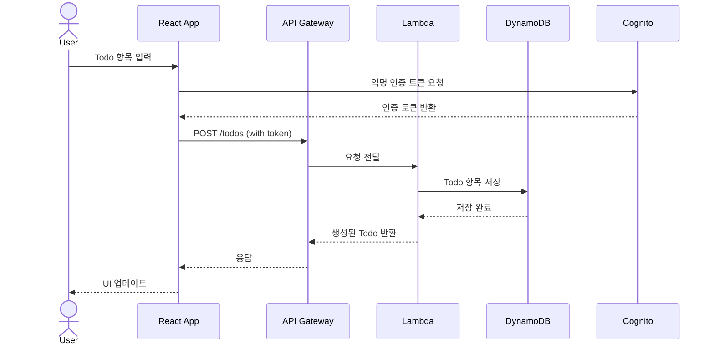
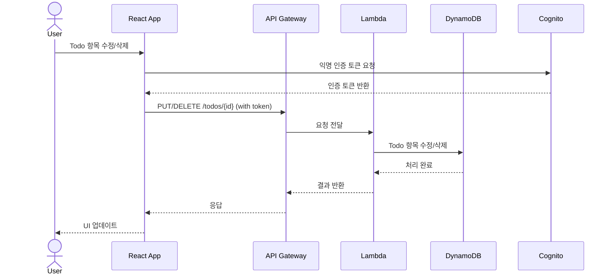

# TODO 애플리케이션 설계 문서

## 1. 개요
서버리스 아키텍처를 활용한 심플한 TODO 웹 애플리케이션입니다. 사용자는 로그인 없이 TODO 항목을 생성, 조회, 수정, 삭제할 수 있습니다.

## 2. 시스템 아키텍처

### 2.1 프론트엔드
- **기술 스택**: React
- **호스팅**: GitHub Pages
- **주요 기능**:
  - TODO 항목 생성, 조회, 수정, 삭제 (CRUD)
  - 반응형 디자인
  - 실시간 상태 업데이트

### 2.2 백엔드 (AWS 서버리스)
- **인프라 관리**: AWS CDK (TypeScript)
- **주요 컴포넌트**:
  - API Gateway: RESTful API 엔드포인트 제공
  - Lambda: 비즈니스 로직 처리
  - DynamoDB: TODO 항목 저장
  - Cognito: 익명 사용자 인증

### 2.3 시스템 상호작용 다이어그램

#### Todo 항목 생성 프로세스


#### Todo 항목 조회 프로세스


#### Todo 항목 수정/삭제 프로세스


## 3. API 설계

### 3.1 엔드포인트
- `GET /todos`: 모든 TODO 항목 조회
- `POST /todos`: 새로운 TODO 항목 생성
- `PUT /todos/{id}`: 특정 TODO 항목 수정
- `DELETE /todos/{id}`: 특정 TODO 항목 삭제

### 3.2 데이터 모델
```typescript
interface Todo {
  id: string;          // UUID
  title: string;       // TODO 제목
  description: string; // 상세 설명
  completed: boolean;  // 완료 여부
  createdAt: string;   // 생성 시간
  updatedAt: string;   // 수정 시간
}
```

## 4. 보안
- Cognito를 통한 익명 사용자 인증
- API Gateway에서 CORS 설정
- Lambda 함수의 최소 권한 원칙 적용

## 5. 인프라 구성 (CDK)
```
├── API Gateway
│   └── /todos 리소스
│       ├── GET    → Lambda
│       ├── POST   → Lambda
│       ├── PUT    → Lambda
│       └── DELETE → Lambda
├── Lambda 함수
│   ├── getTodos
│   ├── createTodo
│   ├── updateTodo
│   └── deleteTodo
└── DynamoDB
    └── Todos 테이블
```

## 6. 개발 및 배포 프로세스
1. 프론트엔드 개발 (React)
2. 백엔드 API 구현 (Lambda)
3. CDK를 통한 인프라 배포
4. GitHub Pages를 통한 프론트엔드 배포

## 7. 모니터링 및 로깅
- CloudWatch Logs를 통한 Lambda 함수 로깅
- API Gateway 액세스 로그 활성화
- DynamoDB 처리량 모니터링
