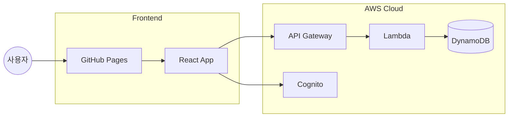
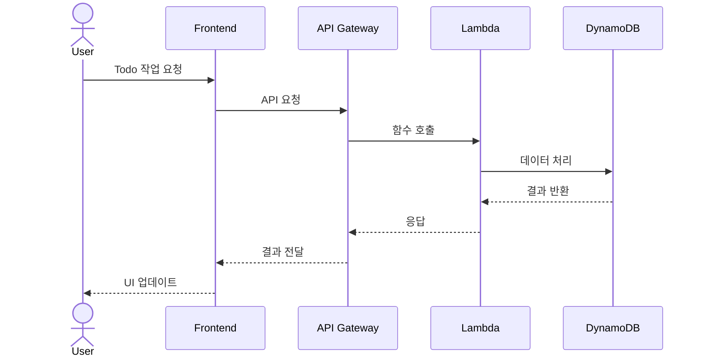
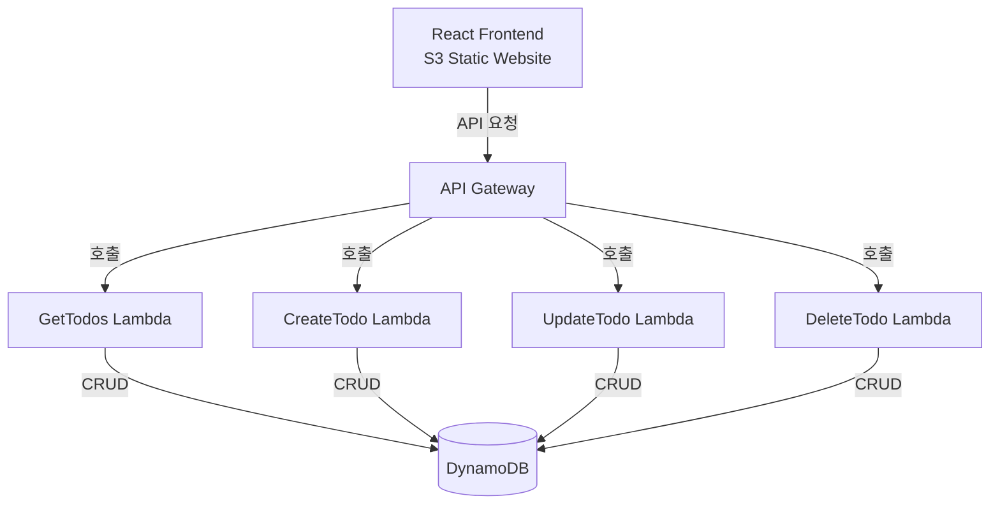

이 프로젝트는 wind surf의 기능을 익히기 위한 playground 입니다.

# 🚀 TODO 애플리케이션

서버리스 아키텍처를 활용한 심플한 TODO 웹 애플리케이션입니다.

## 🏗️ 기술 스택

- 프론트엔드: React
- 백엔드: AWS 서버리스 (CDK, Lambda, API Gateway, DynamoDB)
- 인증: Amazon Cognito
- 배포: GitHub Pages (프론트엔드), AWS CDK (백엔드)

## 🏗️ 시스템 구조

### 시스템 구성도


### 기본 요청 흐름


자세한 시스템 설계 및 시퀀스 다이어그램은 [설계 문서](doc/design.md)를 참조하세요.

## 🌲 브랜치 관리 전략 (GitHub Flow)

### 주요 브랜치
- `main`: 프로덕션 환경에 배포되는 안정적인 코드
- `feature/*`: 새로운 기능 개발 또는 버그 수정을 위한 브랜치

### 브랜치 워크플로우
1. `main` 브랜치에서 새로운 브랜치 생성
2. 변경 사항을 커밋하고 푸시
3. Pull Request 생성
4. 코드 리뷰 및 토론
5. 배포 및 테스트
6. `main` 브랜치로 머지


### Pull Request 프로세스
1. 설명적인 제목과 내용 작성
2. 변경 사항에 대한 상세한 설명
3. 관련된 이슈 링크
4. 테스트 결과 포함
5. 리뷰어 지정

### 커밋 메시지 컨벤션
- feat: 새로운 기능 추가
- fix: 버그 수정
- docs: 문서 수정
- style: 코드 포맷팅
- refactor: 코드 리팩토링
- test: 테스트 코드
- chore: 빌드 업무 수정

예시:
```
feat: Todo 항목 생성 기능 추가
fix: Todo 삭제 시 새로고침 안되는 문제 수정
docs: API 문서 업데이트
```

## 🚀 시작하기

### 사전 요구사항
- Node.js v18 이상
- AWS CLI 구성
- AWS CDK CLI

### 설치 및 실행
```bash
# 프론트엔드
cd frontend
npm install
npm start

# 백엔드
cd backend
npm install
cdk deploy
```

## 📚 문서
자세한 내용은 다음 문서를 참조하세요:
- [설계 문서](doc/design.md)
- [구현 체크리스트](doc/todo.md)

## AWS 아키텍처



### 컴포넌트 설명

#### Frontend
- **S3 Static Website**: React 기반의 프론트엔드 애플리케이션을 호스팅
- 정적 웹사이트 호스팅 기능을 사용하여 웹 애플리케이션 제공

#### Backend
- **API Gateway**: RESTful API 엔드포인트 제공
  - CORS 설정으로 프론트엔드와의 안전한 통신 보장
  - HTTP 메서드: GET, POST, PUT, DELETE 지원

- **Lambda Functions**:
  - `GetTodos`: 할 일 목록 조회
  - `CreateTodo`: 새로운 할 일 생성
  - `UpdateTodo`: 기존 할 일 수정
  - `DeleteTodo`: 할 일 삭제

- **DynamoDB**: 
  - 서버리스 NoSQL 데이터베이스
  - 할 일 데이터 영구 저장
  - 속성: id, title, description, completed, createdAt

### 배포
- GitHub Actions를 통한 자동 배포
- CDK를 사용한 인프라스트럭처 관리